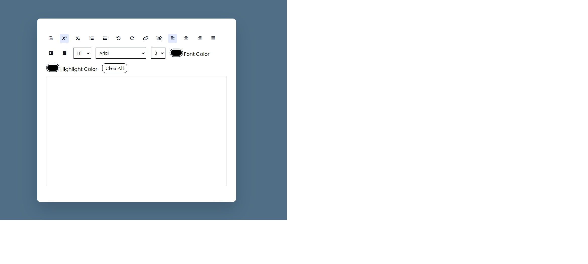

# Text Editor

[Demo](https://ummahanakcantexteditor.netlify.app/)

To enhance my knowledge, I pursued a tutorial on YouTube.

- [JavaScript Text Editor ](https://www.youtube.com/watch?v=gRyvG7PZ4m0&list=PLkC56g8fboI0HghByzVuD2Vz8ROUXfF_j&index=2&ab_channel=AsmrProg)

## Project Overview

With this project I've learned:

- I have gained knowledge in Regex (Regular Expression). For more details, please refer to the documentation below.

  [What are Regular Expressions (Regex)? How are they used? What is Regex in JavaScript?](https://www.youtube.com/watch?v=bF_zEzFQZuA&list=LL&index=1&ab_channel=kablosuzkedi)

  [Medium-Regex tutorial — A quick cheatsheet by examples](https://medium.com/factory-mind/regex-tutorial-a-simple-cheatsheet-by-examples-649dc1c3f285)

  [Practicing with Regex](https://regexr.com/)

- I learned how to enhance the contenteditable attribute in HTML with JavaScript, enabling users to utilize rich text editors in web applications. This significantly improves the experience of creating interactive and dynamic content. For more details, please refer to the documentation below.

  [Tiptap - the Best JS Rich Text Editor for Most Projects](https://www.youtube.com/watch?v=VcnROkRhJ34&ab_channel=CODEISEVERYTHING)

- In the JavaScript file, some code blocks have been written more compactly to enhance efficiency and readability. This approach ensures that the code is simpler and more understandable.
